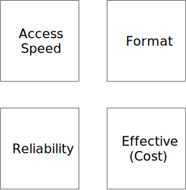

== Chapter 1
== Introduction

In this chapter, we will discuss what data management is and why it is important.

[NOTE]
====
* definition, short, dry
* how is it related to data and how to management
* data management and organization, people handling the data and the data handling tools, and the data controlling the handling tools (meta data) and the meta-data handling tools and so on recursively
====

== What is Data Management

Data management is the act of gathering, storing, processing, accessing, and disposing data in an enterprise environment.
We, humans, practiced it for thousands of years.
When somebody first time carved the amount of sheep they had or owed to someone else into palatable, they did data management.
They did not know it at the time, and they did not call with this name.
It did not stop there.
Data management is a fundamental part of our lives.
When you crumple a printed invoice and throw to the bin, preferably after paying, you perform data management.
Everybody does data management, and so you can think that data management is simple.
Why should we care about it then?

To enlighten the importance of the scientific approach, let's look at another example.
This example is walking.
Everybody walks and walking is simple, isn't it.
However, if you want to walk a long distance, you need to prepare for it.
It matters how you move, what you wear, and what you eat.
It is a science.

If you want to design a robot that walks, you have to understand the science of walking.
If you need to create an industrial exoskeleton that helps people to walk, again, you have to understand the science of walking.
Waling is not simple.

Similarly, data management is simple when it is.
However, when you want to do it in a large enterprise, in a complex environment, it is not simple anymore.
You have to design the system that handles the data.

The enterprise has to have a system to handle the data that can present it

* when it is needed, (TIME)

* the way it is needed, (FORMAT)

* reliable (RELIABILITY), and

* effective (COST).

The underlying gathering, storing, processing, accessing, and disposing are the means to achieve the goals.
They are not the goals themselves.
Data management has one single goal: to have the right data at hand when it is needed.

Later in this book, we will look at the data management systems always keeping in mind the goals.
We do not manage the data l'art pour l'art.

The goals are not independent.
If we do not care about the costs, we can store everything on the fastest, most expensive storage medium.
If we do not care about reliability, we can get a very cheap solution.
We may design a system doing detailed and slow formatting if we do not care about the time.
We may also omit consistency checks jeopardizing reliability to get the data faster.

Usually, as the diagram depicts, timely access, reliability and format many times contradict the cost factor.

In practice, we usually end up with some practical approach, which is a compromise between the goals.
It should tune the different parameters of the data management resulting in the highest business value.
After all, the bottom line is always the business value the enterprise can achieve with the proper support of the data.

The appropriate data management enables the organization to operate and generate value.
The cost of the operation including the cost of the data management should be subtracted from the value to get a net value.
We usually optimize for the net value.

In the case the organization is a business, we call this net value profit.
In this book, we many times talk in business terms, talking about money and profit.
It is important, however, understand that the same principles apply to any organization.
Organizations being business or non-profit generate values and have costs measured in money or other units.

Since the costs of the data management are usually expressed in money units, it is easier to estimate the net gain if the value is also expressed in money units, but it is not a requirement.
There are values, like the value of human life, that are hard to express in money units.
In these cases, it is harder to engineer an acceptable compromise, and it is also outside the scope of this book.

In the rest of this chapter, we will look at these goals in more detail.
At the end of the chapter we will look at the different areas of Data Management.

== Data Management Goals

In this section, we will look at the four goals fo data management.

=== Time: Data when it is needed

The data should be available when it is needed.
It is a fairly obvious statement, but it is not always easy to achieve.
Usually there is no problem with it.
The data is on the disk in a relational database or in the cloud.
The access time is a mere few milliseconds.
So what is the problem?

The problem emerges when the amount of the data is not trivial.
What is trivial depends on the context and it always changes.

When the storage prices drop, it may seem that we can store everything forever on a fast storage medium.
Data formerly stored on punch card is stored on magnetic tape, surpassing the read speed of the punch cards by orders of magnitude.
There is a short period of euphoria until the amount of the data grows to the level that we face the same problem again, on a different level.
Then we realize that optical storage and disks became cheap, and we can store everything on them again.

The reality is that data a storage price drop solves the problem only temporarily and only for some of the data.
There will always be data needing careful design for the storage to ensure fast access.

You have to carefully design multi-layered data storage systems to ensure that data frequently accessed is stored on fast storage media and data rarely accessed is stored on cheaper media.

The access speed is not the only problem that belongs to this goal.
The data sometimes is so waste that it is not possible to query and retrieve some part of it in a reasonable manner.

There was a bank robbery in Hungary in 2002 leaving three people dead.
The investigation led to three suspects who were arrested and convicted a few months later.
The case is so famous because eight years later, in 2010, the Hungarian Supreme Court found that the suspects were innocent.
The real culprits were found using mobile cell data.

The data was there in the archives, but it was challenging to query and retrieve it.
There were 11 million mobile contracts in the country.
Every mobile phone contacted the cell towers every few minutes.
It means 1'541'760'000'000 records for the 8 years.
Approximately 180 Peta Bytes of data meaning 180,000 physical disks in 2010.
Most of the data were on 8mm magnetic tape, and they were not structured in a way that would allow easy querying.
Analyzing the data meant a special IT project at the mobile operator.
The experts had to write a special program reading the tapes, filtering most of the data and writing the selected part to a database for further analysis.

Extracting the data from the archive took months.

This example is about timing, but it is also about the other goal: format.

=== Formatted, the way it is needed

Continuing from the last example, the format of the data was not suitable for the analysis.
It was readable, but it was not easy to query, and it had to be converted.

Having the usable and processable format of the data is and was always a challenge.
When different systems communicate with each other and send and receive data, they have to agree on the format.
THe systems communicating are usually separated by space connected by some data line, but sometimes there is also a time separation.

In the example above, the data was stored on 8mm magnetic tapes, which were still readable in 2010.
There was no issue with the tape readers, and the physical format.
The storage structure, the bytes on the tape, however, changed during the years.
The program reading the data had to consider the year the tape was written and interpret the bytes accordingly.

When the time separating is even larger, the problem is even more challenging.
I recently had the idea only for a moment to get hold on the text of the Z80 assembly programming booklet that I wrote in 1986.
The text exists in magnetic format on a compact cassette.
It was written out as audio signals by a ZX Spectrum computer.
The first challenge would be to read the audio signals from the tape and convert to bytes.
To be honest, I gave up already at this point, but for the sake of the mental exercise, let's continue.
If we have the byte streams, we will need a word-processor that can read the file.
I created the booklet using the Tasword word-processor on the ZX Spectrum.
(https://en.wikipedia.org/wiki/Tasword)
I could probably run it on an emulator, but then I still can only display the text on screen.
I would need to convert it to a format that I can use on my computer.

Still, only for the sake of the mental exercise, let's assume that I have the text in a format that I can use.
Since Tasword stored the text in a continuous stream of bytes, this should be possible.
The text is Hungarian.
It means it uses special characters from the time when there was no Unicode.

In this case, my data management analysis concluded that the best solution is to have the text as a single, still existing printed copy on my shelf, there is no significant business value retrieving the text electronically.

However, we do not need to go that far in time, which is usually the realm of archives.
Every two systems that communicate must agree on the format.
Usually the data travels on a network, and the format is defined by the protocol.
The end systems convert the data suitable for the transfer to and from, even when the format on the two ends is identical.

Many times we think on a high-abstraction level.
Programmers do not and usually should not care about the physical format of the data.
It is only important when there is some problem sourcing from the lower level to the higher ones.

One real example is when the byte order is different on the different systems.
Intel based architectures usually store integer numbers storing the lowest byte first.
It is called little-endian.
Motorola and IBM architectures store the highest byte first.
It is called big-endian.
When the two systems communicate, they have to agree on the byte order.

Today we usually do not care too much about the byte order, because the underlying software layers, the frameworks handle this issue for us.
Also, there is no significant performance benefit playing tricks relying on the byte order.
However, it was not always the case, and when out application has to access data also handled by or sourcing from old systems, we have to be careful.

An example, I came across, is a database designed in the 1970s.
Calling it a database is a bit of a stretch today, because the meaning and usage of that word changed.
If you know the history, the 1970s were way before SQL and relational databases.
The database was a huge file on a mainframe computer.
The file format was defined in a document on the byte level, binary to save every possible storage space.
The data as well as the search-helping data, we would call those to indices was it a modern relation database were stored in the same file.
Part of the data were numeric identifiers identifying towns of a small country.
It was known that the number of the towns will never exceed 65'536.
The designers of the database decided to store the identifiers in two bytes.
They also assigned the lower numbers to towns with higher population and to those that had local presence of the company.
In this case, the number was less than 256.
Unfortunately, the developers, who wrote the assembly code that time relied on this fact and were fetching the second byte from the database only when the program code was handling the location of an affiliate.

At that time, this was a neat trick, resulting in smaller and simpler code.
The developers all knew this, it caused no problem understanding what the code was doing.

Moving this code to a modern system, however, was a challenge.
The code was rewritten in C using  automatic transition tools, and the target system was little-endian.
It means that the byte order of the two-byte identifiers was reversed.
When the converted code was reading the identifiers, it was always zero.
During the migration project, for a while, it was a mystery why all affiliates were moved to the capital, identified by the number zero.

Data management has to support the proper formatting of the data.
It is usually about the logical format, but sometimes it is also the physical format.
When designing a system, we do not need to care about the physical format, but we have to be aware of it.
And this, also leads to the next goal: reliability.

=== Reliable, the data is correct

The data has to be correct, or else there is not much use of it.
There are three types of errors in the data.

* The data is corrupted during the transfer.
* The data is corrupted during processing.
* The data comes erroneous from the source.

Data management addresses these issues with different tools and methods.
There is no single solution for all of them, and also there is no solution that would guarantee 100% data correctness.

Data corruption during the transfer is usually addressed by technical solutions.
The underlying protocol can and should provide the means to detect and possibly correct data errors.
These technical solutions are usually transparent to the applications, and we treat them as foolproof solutions.
It is important to understand that there is no such thing as 100% data correctness.
In the case of transfer errors, however, the preventive measures can be very effective with reasonable costs.
When we have 99.999...99% data correctness, where the number of the digits following the decimal point is large enough, we can consider it as 100% correctness.

Data corruption during the processing can also be a technical issue, the human factor in this case is more important.
Although it is possible that the data processing corrupts the data, the probability of such an event is close to zero.
There are very few examples where such data corruption was suspected.
The most well-known example is the Phobos-Grunt Spacecraft case.

The Russian space mission Phobos-Grunt, which was intended to visit Mars' moon Phobos, experienced a failure that was later attributed to a bit flip.
After launch in 2011, the spacecraft was supposed to boost itself on a course to Mars, but it never left Earth orbit.
Investigations suggested that a single event upset (SEU), likely caused by cosmic rays, affected the onboard computer system, leading to the mission's failure.

Other examples usually describe space or aviation applications.
In each of these cases, the error is caused by a bit-flip from cosmic rays.
In our enterprise applications, executing in data centers the probability of such an event is close to zero.
We usually do not address these in the applications.

The processing, however, can also be the source of human-induced error.
The data can be corrupted by the application code or by human operator interaction.
Data management has to be prepared to detect these errors, and it has to provide the means to correct them.

This issue is similar to the last case, when the data is erroneous at the source.
The realm of data management is finite and has borders.
The data coming from the outside has to be treated with care and has to be validated.
Validation and corrections are done at the entry points of the system.

A simple and frequent example is the spelling of names.
The data entry operator may make a typo spelling the name.
They may spell the name the usual way while the specific person spells it differently.
It may be misheard and replaced by a different name.

The means to address these issues is technical and human.
The data has to be checked against a list of valid names, checking usual misspellings.
This will not identify the error, but such an approach may filter the names that are most likely erroneous.
Data may be entered for the same information at different points of the system and these can be checked for consistency.

No matter how many times you check the names, there will always be some errors remaining.
Most of the errors can be corrected cheap and the more correctness we want to reach, the more expensive it gets.
It is the well-known diminishing return phenomenon.
There is a point where the extra check of the data results in so small correction that it is not worth the effort.

And this leads to the last goal: cost.

=== Effective, costs are controlled

Data management systems are not free.
Every bit stored for a second costs money, as well as every bit-flip.
The cost is usually expressed in money terms, but these days it is also expressed in energy consumption.

== Environments of Data Management