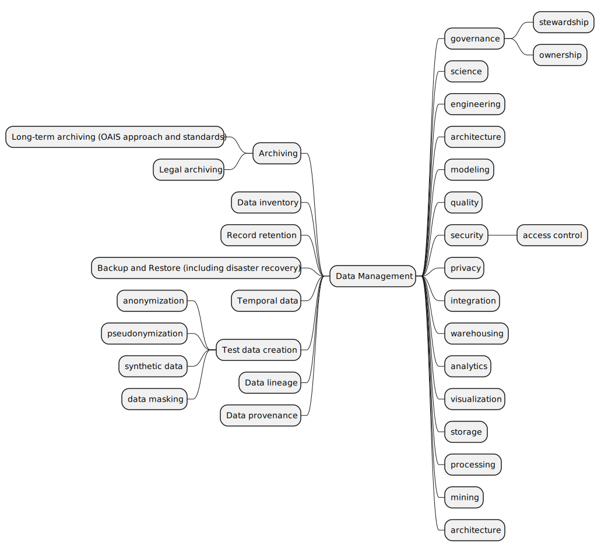

= Topics for the Data Management Book

This document is a work document and not part of the book.
It is used to collect ideas and to structure the book.

== The topics to cover in the book

In this section, we list the topics as a mind map and also as a short description of each topic.
Topics are not one-to-one mapped to chapters, though some topics may finally be converted to a separate and dedicated chapter.
For example, Data Inventory surely deserves a dedicated chapter.

This document and the mind map are work documents and not part of the book.
They will be changed as we work on the book, and they may be extended with references to the book parts where the different topics are discussed.

=== Data Management
=== governance
Data governance refers to the collection of practices, rules, standards, and metrics that ensure the effective and efficient use of information in enabling an organization to achieve its goals. It encompasses the processes, roles, policies, standards, and metrics that ensure the effective and efficient use of information in enabling an organization to achieve its goals. Here are the key components:

1. **Data Quality**: Ensuring that data is accurate, complete, and reliable.
2. **Data Management**: Defining how data is collected, stored, and accessed, including privacy protections.
3. **Policy & Standards**: Creating rules and regulations for data management and use.
4. **Compliance**: Ensuring that data usage follows both internal policies and external regulations.
5. **Data Security**: Protecting data from unauthorized access and ensuring confidentiality, integrity, and availability.
6. **Data Architecture**: Structuring data frameworks and models to support data quality, access, and analysis.

Effective data governance helps organizations make better decisions, comply with regulatory and legal obligations, protect sensitive data, and manage data across its lifecycle. It is a strategic, ongoing, and evolving practice that requires continuous attention to adapt to changing data-related challenges and opportunities.

==== stewardship

Data stewardship is a critical component of data governance, focusing on the management and oversight of an organization's data assets. It involves the responsibility and authority for ensuring that data is managed effectively throughout its lifecycle. Here are key aspects of data stewardship:

1. **Accountability and Responsibility**: Data stewards are individuals or teams responsible for managing data quality, accessibility, consistency, and security. They ensure that data policies and guidelines are implemented effectively across the organization.

2. **Data Quality Management**: This includes tasks such as defining data quality metrics, monitoring data quality, and implementing initiatives to improve the quality of data.

3. **Data Lifecycle Management**: Data stewards oversee the entire lifecycle of data, from creation and acquisition through archiving and deletion, ensuring that it is accessible, maintained, and secured.

4. **Compliance and Risk Management**: They ensure data is managed in compliance with relevant laws, regulations, and standards, mitigating risks associated with data breaches, inaccuracies, or misuse.

5. **Metadata Management**: Data stewards often oversee the management of metadata, ensuring that data context, lineage, and definitions are clear and maintained.

6. **Communication and Collaboration**: They often serve as a bridge between IT and business units, ensuring that data-related policies and practices align with business objectives and that stakeholders understand and adhere to those policies.

Data stewardship is about ensuring valuable data assets are properly managed and utilized effectively, safeguarding the integrity and value of the data. Effective data stewardship requires a mix of technical skills, understanding of the business and its objectives, and the ability to communicate and enforce policies across various departments.

=== ownership
Data ownership refers to the responsibility and control over data within an organization. It involves having legal rights and complete governance over the lifecycle of one or more sets of data elements. Here are the key aspects of data ownership:

1. **Responsibility**: Data owners are responsible for the data's accuracy, privacy, security, and reliability. They ensure that the data is accessible to those who need it while protected from unauthorized access.

2. **Accountability**: Data owners are accountable for managing the data in accordance with the organization's policies and regulatory requirements. They are answerable for the quality and integrity of the data and may be involved in addressing any issues related to the data they own.

3. **Authority**: Data owners have the authority to make decisions about how their data is used and managed. This includes defining policies for data access, usage, archiving, and disposal. They might also have the power to delegate certain responsibilities to data stewards or custodians.

4. **Maintenance and Quality**: They are often responsible for maintaining the data's quality throughout its lifecycle. This includes overseeing or approving any changes, updates, or deletions to the data.

5. **Decision-Making**: Data owners play a critical role in decision-making processes related to the data. They may decide who has access to the data, what tools are used to manage the data, and how data quality is maintained.

Data owners are typically members of the organization who have a deep understanding of the data and its use in business processes. They are often senior members or executives of a department that generates or heavily relies on the data. In some cases, the role of a data owner might be held by a group or committee rather than an individual.

Effective data ownership is a critical component of data governance. It ensures that data is managed as a valuable resource, meets the organization's needs for information, and complies with all relevant regulations and standards. While the data owner has overall responsibility for the data, they often work closely with other roles, such as data stewards, data custodians, and data users, to manage and use the organization's data effectively.

==== Stewardship vs. Ownership

Data ownership and data stewardship are both integral parts of data governance, but they focus on different aspects of managing and overseeing data within an organization. Here's a breakdown of their differences:

**Data Ownership**:

1. **Authority and Responsibility**: Data owners are typically senior executives or department heads who have ultimate responsibility and legal authority over specific sets of data. They are accountable for the management and governance of the data, including its accuracy, privacy, and security.
2. **Decision-Making**: Data owners have the final say in decisions regarding the data they own. This includes how it's used, who can access it, and how it's maintained.
3. **Accountability**: They are accountable for ensuring that the data is used in compliance with relevant policies, standards, and regulations. This often involves strategic decision-making and policy setting.
4. **Role**: The role of a data owner is usually a formal, recognized position within an organization, often held by someone with a deep understanding of the business and the data's role within it.

**Data Stewardship**:

1. **Management and Oversight**: Data stewards are responsible for the day-to-day management and quality of data. They often work under the guidance of data owners to implement policies and standards, manage data-related projects, and ensure data quality.
2. **Operational Role**: Data stewards are typically more involved in the operational aspects of data management. They might be responsible for data cleaning, metadata management, data classification, and enforcing data governance policies.
3. **Facilitation and Coordination**: Data stewards act as a bridge between different parts of the organization, coordinating data-related activities and ensuring that different departments adhere to governance policies.
4. **Role**: The role of a data steward is often more hands-on and technical compared to that of a data owner. They may not have the authority to make broad policy decisions but are crucial for maintaining the quality and integrity of data.

**Key Differences**:

- **Level of Authority**: Data owners have higher authority and are ultimately responsible for the data. Data stewards have operational responsibility for managing data quality and adherence to policies set by the owners.
- **Focus**: Data owners are focused on the strategic aspect of data governance, making high-level decisions about the data. Data stewards focus on the tactical and operational aspects, handling the day-to-day management and quality control of the data.
- **Decision-Making vs. Implementation**: Data owners are involved in decision-making and setting policies for data use and management. Data stewards are responsible for implementing these policies and ensuring that data is managed according to the owners' directives.

In many organizations, data stewardship roles support the broader goals set by data owners. Both roles are critical for effective data governance and need to work in coordination to ensure that data is a valuable and well-managed asset within the organization.

=== science
=== engineering
=== architecture
=== modeling
=== quality
=== security
=== access control
=== privacy
=== integration
=== warehousing
=== analytics
=== visualization
=== storage
=== processing
=== mining
=== architecture
=== Archiving
=== Long-term archiving (OAIS approach and standards)
=== Legal archiving
=== Data inventory
=== Record retention
=== Backup and Restore (including disaster recovery)
=== Temporal data
=== Test data creation
==== anonymization
==== pseudonymization
==== synthetic data
==== data masking
=== Data lineage

Data lineage refers to the journey of data as it travels through various processes in an information system. It's a kind of 'data life story' that explains the data's origins, what happens to it, and where it moves over time. Understanding data lineage is critical for various aspects of data management and governance, including data quality, data security, and compliance. Here's a more detailed look at the key aspects of data lineage:

1. **Origin of Data**: Data lineage starts by identifying where data comes from. This could be internal databases, external data sources, or even manual data entry. The origin is crucial for understanding the initial context and quality of the data.

2. **Data Movement**: It tracks each step that data takes as it moves through various systems. This could involve data being transferred between databases, imported into data warehouses, or processed by analytical applications.

3. **Transformation and Processing**: Data often undergoes various transformations — it might be cleaned, aggregated, or restructured. Data lineage tracks these transformations to understand how they affect the data's final form and meaning.

4. **Consumption**: Ultimately, data is used or consumed in some way — for reporting, analytics, or to inform business decisions. Data lineage includes tracking how data is used and by whom.

5. **Version Control**: As data changes, it might go through various versions. Tracking this is part of understanding its lineage.

Understanding data lineage is important for:

- **Data Quality**: By understanding where data comes from and how it's transformed, organizations can better assess and improve its quality.
- **Compliance**: Many regulations require knowing where sensitive data comes from and how it's been handled. Data lineage helps in demonstrating compliance with these regulations.
- **Troubleshooting and Auditing**: If there are errors or issues with data, understanding its lineage allows organizations to trace back through its history to identify where things might have gone wrong.
- **Impact Analysis**: Before making changes in the system, organizations can use data lineage to understand the potential impact on data throughout the organization.

Tools and technologies for managing data lineage vary from manual documentation to sophisticated automated solutions that integrate with data management systems. As data ecosystems become more complex, effective data lineage becomes both increasingly challenging and critical. It's an essential component of a robust data governance strategy, helping ensure that data remains accurate, consistent, and trustworthy throughout its lifecycle.

=== Data provenance

Data provenance refers to the documentation or tracing of the history and lifecycle of data, from its origins through its various uses and transformations. It provides a detailed record of the data's source, where it moves, how it is processed, and how it changes over time. Understanding data provenance is crucial for several reasons, including ensuring data reliability, integrity, and reproducibility. Here are some key aspects of data provenance:

1. **Source Tracking**: Data provenance involves recording the original source of the data, whether it's from an internal system, an external data provider, or a sensor collecting data.

2. **Data Transformation**: It tracks all changes, transformations, or manipulations the data undergoes throughout its lifecycle. This includes changes in format, structure, or content.

3. **Ownership and Custody**: It includes a history of who has owned or been responsible for the data at different stages of its lifecycle.

4. **Versioning**: Data provenance keeps track of different versions or states of a data item over time, providing a history of its evolution.

5. **Purpose and Usage**: It documents how and why data was used in various contexts, including in analyses, reports, or decision-making processes.

Understanding data provenance is essential for:

- **Quality Assurance**: Ensuring the accuracy and quality of data by understanding its origin and transformations.
- **Compliance**: Meeting legal and regulatory requirements, especially in industries where how and where data is acquired and processed is strictly regulated.
- **Reproducibility**: Allowing analyses or results to be reproduced by providing a clear record of the data and methodologies used.
- **Security**: Identifying and mitigating risks associated with data, including understanding potential points of compromise in its history.

In practice, maintaining data provenance involves using a combination of methods and technologies, including metadata management, data lineage tools, and documentation practices. As data environments become more complex, particularly with the rise of big data and cloud computing, maintaining clear and comprehensive data provenance is becoming both more challenging and more critical.

=== Data lineage vs. Provenance

Data provenance and data lineage are closely related concepts in data management and governance, often used to ensure data quality and integrity. While they overlap, they focus on different aspects of data's journey and history.

1. **Data Provenance**:
- **Definition**: Data provenance is concerned with the origin of the data and its life history, including its creation, origins, and the changes and processes it has undergone. It provides a detailed historical record of the data's background and its modifications.
- **Focus**: The focus is on the authenticity and pedigree of the data. It's about understanding the data's source, the context in which it was collected, and any alterations it has undergone.
- **Purpose**: Provenance is used to assess the quality, reliability, and trustworthiness of data. It's particularly important in scientific data and research, where understanding how data was generated and transformed is crucial for reproducibility and validity.

2. **Data Lineage**:
- **Definition**: Data lineage refers to the data's journey through various systems and processes. It provides a visual representation or map of the data flow from source to destination, including all the transformations it undergoes along the way.
- **Focus**: The focus is on the data's movement and transformation across the system. It's about tracking the data's path, how it's been transformed, aggregated, split, or calculated across its lifecycle.
- **Purpose**: Lineage is used for troubleshooting data issues, impact analysis, and ensuring regulatory compliance. It helps in understanding how changes in one part of the system will affect other parts, and it's essential for diagnosing errors or anomalies in data.

**Key Differences**:

- **Scope of Detail**: Provenance provides a deep, historical context of data, including its original source and all transformations. Lineage provides a broader view of where data has moved and how it has been altered, focusing more on the path than the detailed history of transformations.
- **Usage**: Provenance is often used for validating the authenticity and integrity of data, especially in scientific research, legal, and compliance contexts. Lineage is used in data management for impact analysis, error tracking, and understanding how data flows through systems.
- **Visualization**: While both can be visualized, lineage is typically represented as a flowchart showing the data's journey through systems. Provenance might be represented in a more detailed and complex format, showing a comprehensive history of the data.

In practice, both data provenance and data lineage are critical for comprehensive data governance and management. They are often used together to ensure that an organization's data is accurate, reliable, and used appropriately, providing a complete picture of the data's history, from its origin to its current state.